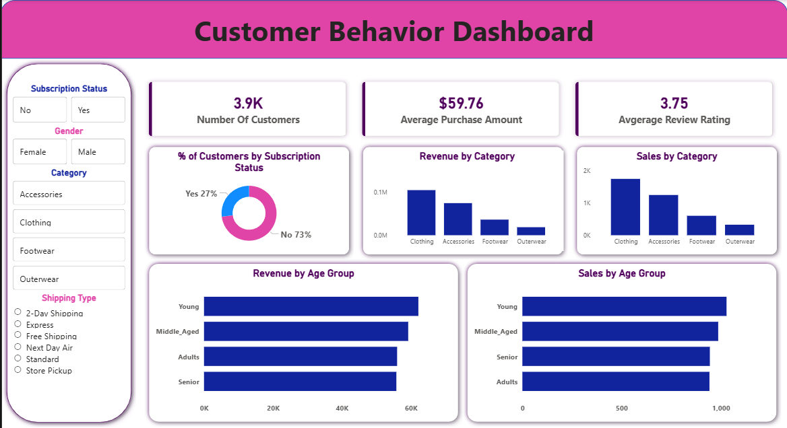

# RetailPulse: Consumer Behavior & Purchase Intelligence

## 📊 Project Overview
This project analyzes consumer shopping behavior for a retail company to uncover trends in purchasing patterns, customer loyalty, and key decision drivers such as discounts, reviews, seasons, and sales channels.

The goal is to enable data-driven decisions that improve sales performance, customer engagement, and long-term loyalty.

---

## 🧩 Business Problem
How can a retail company leverage consumer shopping data to:
- Identify purchasing trends
- Improve customer engagement
- Optimize marketing and product strategies?

---

## 🛠️ Tech Stack
- **Python**: Data cleaning, preprocessing, feature engineering  
- **Microsoft SQL Server**: Data modeling, business queries, analytical views  
- **Power BI**: Interactive dashboards and visual insights  
- **GitHub**: Version control and project documentation  

---

## 📂 Dataset Summary
- **Records**: ~3,900 transactions  
- **Features**: Customer demographics, purchase details, discounts, reviews, subscriptions, shipping type  
- **Missing Data**: Review ratings handled using median imputation  

---

## 🔄 Project Workflow
1. Cleaned and transformed raw data using Python (Pandas)
2. Loaded processed data into Microsoft SQL Server
3. Designed SQL queries to analyze customer segments, loyalty, and purchase drivers
4. Built interactive Power BI dashboards for stakeholder insights

---

## 📈 Key Insights
- Identified top-rated and most-purchased products
- Analyzed discount dependency across product categories
- Compared subscriber vs non-subscriber spending behavior
- Segmented customers into New, Returning, and Loyal groups
- Evaluated revenue contribution by age group and sales channel

---

## 📊 Power BI Dashboard
The dashboard provides:
- Executive KPIs (Revenue, Customers, Average Rating)
- Product performance analysis
- Discount and loyalty insights
- Customer segmentation visuals

---

## 📊 Power BI Dashboard

Below is a snapshot of the interactive Power BI dashboard built for this project:

---

## 📌 Business Recommendations
- Promote subscription-based loyalty programs
- Optimize discount strategies for price-sensitive products
- Highlight top-rated products in marketing campaigns
- Focus targeted promotions on high-revenue age groups

